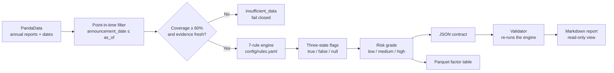

<div align="center">

# 🚩 Accounting Red Flag Detector

### Lavine Version

**Agent investigates · Rules decide · Evidence explains**

<sub>A <strong>point-in-time</strong> accounting-quality screener for China A-shares</sub>

<br/>

[](https://github.com/lavine888/Accounting-Red-Flag-Detector/actions/workflows/validate.yml)
[](https://www.python.org/)
[](LICENSE)
[](#-tests)
[](CHANGELOG.md)
[](#-the-seven-red-flags)
[](#-output-contract)

[Quick Start](#-quick-start) ·
[Red Flags](#-the-seven-red-flags) ·
[Output Contract](#-output-contract) ·
[Data Boundaries](#-data-source-and-boundaries) ·
[中文](README.md)

</div>

---

> ### 🧭 In one sentence
> Apply **seven accounting red-flag rules** to each company's **own annual reports that were already
> announced before the decision date**, and emit **auditable** JSON / Parquet artifacts plus a
> forward-return research backtest.
> **Missing data is never guessed as zero; insufficient evidence is never downgraded to "low risk".**

## 📖 Table of Contents

| | |
| --- | --- |
| [🎯 Why](#-why-this-exists) | [🚩 The Seven Red Flags](#-the-seven-red-flags) |
| [🚀 Quick Start](#-quick-start) | [📦 Output Contract](#-output-contract) |
| [🔌 Data Source and Boundaries](#-data-source-and-boundaries) | [🗂 Structure](#-structure) |
| [✅ Tests](#-tests) | [🚫 Explicitly Out of Scope](#-explicitly-out-of-scope) |
| [🗺 Roadmap](#-roadmap) | [📄 License](#-license) |

---

## 🎯 Why This Exists

Three classic mistakes in traditional financial screening, and how this project handles them:

| ❌ Common mistake | 💥 Consequence | ✅ How this project handles it |
| --- | --- | --- |
| Screening history with the latest report | Look-ahead bias; inflated backtests | Point-in-time filter on announcement date; same-day revision conflicts fail closed |
| Filling missing values with `0` | Treats "no data" as "no problem" | Missing = `null`, which lowers coverage and triggers `insufficient_data` |
| Scoring today with a years-old report | Companies that stopped filing look safe | Evidence age > `max_evidence_age_years` fails closed |
| One threshold set for all industries | Banks have no "operating cost" or "inventory" | Financials return an explicit `not_applicable` |

### 🧱 Design principles

| Principle | Meaning |
| --- | --- |
| 🕰 **Point-in-time** | Only report versions with `announcement_date <= as_of` are used. No look-ahead. |
| 🚦 **Three-state flags** | `true` / `false` / `null`; missing evidence stays `null`, never `0`. |
| 🔒 **Coverage fail-closed** | Evidence coverage below 60% becomes `insufficient_data`, never `low` risk. |
| 📅 **Freshness fail-closed** | If the newest visible annual report lags `as_of` by more than `max_evidence_age_years` (default 2), the result is `insufficient_data`. |
| 🏦 **Financials excluded** | Banks, insurers and brokers return `not_applicable` instead of being forced through industrial rules. |
| 🎛 **Central thresholds** | All thresholds live in `config/rules.yaml`. No magic numbers in code. |

### 🔄 Workflow



---

## 🚩 The Seven Red Flags

All thresholds live in [`config/rules.yaml`](config/rules.yaml).
`latest` is the most recent visible annual (q4) report; `prior` is the year before it.

| ID | Name | Condition | Default threshold |
| :---: | --- | --- | :---: |
| **RF01** | Profit / cash-flow divergence | `CFO / net profit < cash_conversion_min` | `0.80` |
| **RF02** | Receivables outgrowing revenue | `AR growth > 0.20` **and** `AR growth − revenue growth > 0.20` | `0.20 / 0.20` |
| **RF03** | Inventory outgrowing revenue | `inventory growth > 0.20` **and** `inventory growth − revenue growth > 0.20` | `0.20 / 0.20` |
| **RF04** | Excessive accruals | `(net profit − CFO) / average total assets > accrual_ratio_max` | `0.10` |
| **RF05** | Gross-margin anomaly | `\|latest margin − historical mean\| > max(0.05, 2σ)` | `0.05 / 2.0` |
| **RF06** | Profit / revenue growth divergence | `profit growth > 0.30` **and** `profit growth − revenue growth > 0.30` | `0.30 / 0.30` |
| **RF07** | Multi-year cash-conversion deterioration | last 3 years `CFO / net profit` **strictly decreasing** and latest `< 0.80` | `3y / 0.80` |

> Rule details, field definitions and edge cases: [`references/methodology.md`](references/methodology.md).

### 🎚 Risk levels

| Red flags | Risk | Production signal | Note |
| :---: | :---: | :---: | --- |
| 0–1 | `low` | `clear` | pass |
| 2–3 | `medium` | `watch` | watch |
| ≥ 4 | `high` | `review` | priority review |
| coverage < 60% | `insufficient_data` | `unknown` | fail closed |
| newest annual report older than 2 years | `insufficient_data` | `unknown` | fail closed |
| financial industry | `not_applicable` | `not_applicable` | explicitly excluded |

> ⚠️ Risk level grades **evidence strength**, not expected return. It is not investment advice.

### 🧬 Industry-relative evidence (peer context, never changes a verdict)

RF02 / RF03 / RF04 / RF06 compare a company only against its own prior year, so industries with
structurally high receivables, inventory or accruals (real estate, construction, government-facing
contractors) can be false-positived. Every record carries a `peer_context` block with the company's
percentile within its **Shenwan L1 industry**. When the industry pool is smaller than
`peer_min_sample` (default 5) the metric is simply absent, never guessed.

> **This is context, not absolution:** `peer_context` never changes a flag or a risk level. The rules
> decide independently, because systemic fraud often makes a whole value chain look alike —
> normalising an anomaly away because peers share it would hide exactly the cases the tool exists to
> surface. The validator recomputes `peer_context` from the re-derived evidence, so tampering fails.

---

## 🚀 Quick Start

> **Requires Python 3.11**

```bash
pip install -r requirements.txt        # runtime
pip install -r requirements-dev.txt    # includes pytest

# Credentials are read from environment variables only, never written to files or logs
export PANDA_DATA_USERNAME=...
export PANDA_DATA_PASSWORD=...
export PANDA_DATA_BASE_URL=http://pandadata.pandaaiquant.com   # optional
```

| Scenario | Command |
| --- | --- |
| **One company** | `python scripts/build.py --as-of 20251231 --symbols 600519.SH` |
| **Full SH/SZ market** | `python scripts/build.py --as-of 20251231 --all-sh-sz ...` |
| **Offline demo**<br/><sub>synthetic data, not real results</sub> | `python scripts/build.py --as-of 20251231 --all-a --provider fixture` |
| **Validate** | `python scripts/validate.py output/red-flags.json` |
| **Render report**<br/><sub>validates first</sub> | `python scripts/report.py output/red-flags.json --min-risk medium --output output/report.md` |
| **Research backtest** | `python scripts/backtest.py --signal-dates 20221230 20231229 20241231 --all-sh-sz --output output/backtest.json` |

<details open>
<summary><strong>Full commands (including full-market parameters)</strong></summary>

```bash
# One company
python scripts/build.py --as-of 20251231 --symbols 600519.SH

# Full SH/SZ market
python scripts/build.py --as-of 20251231 --all-sh-sz \
    --cache-dir output/panda-cache \
    --request-interval 1.2 --workers 8 \
    --json-output output/red-flags.json \
    --parquet-output production/database.parquet

# Offline synthetic demo (NOT real results)
python scripts/build.py --as-of 20251231 --all-a --provider fixture

# Validate
python scripts/validate.py output/red-flags.json
python scripts/validate.py production/database.parquet

# Render a validated result as Markdown (refuses unvalidated input)
python scripts/report.py output/red-flags.json \
    --min-risk medium --output output/report.md

# Research backtest
python scripts/backtest.py \
    --signal-dates 20221230 20231229 20241231 \
    --all-sh-sz --output output/backtest.json
```

</details>

<details>
<summary><strong>📌 Guarantees and boundaries of each command</strong></summary>

- **The validator** **re-derives** every aggregate and every risk level. Hand-edited, truncated or
  version-mismatched artifacts fail.
- **`report.py`** validates before rendering and refuses unvalidated artifacts (fail closed). It turns
  a validated result into a deterministic Markdown report: summary, triage list (each triggered rule
  with its value vs threshold, key evidence, peer percentile), an `insufficient_data` list, and
  provenance. Missing values render as `—`, never `0`. `--min-risk high` shows only high risk;
  `--limit N` caps the list.
- **`--provider fixture`** uses synthetic demo data: results carry `requires_live_validation=true`
  and cannot be written to the canonical `production/database.parquet`.
- **The backtest** groups by red-flag count (0/1/2/3/4+) and risk level, reporting 3 / 6 / 12-month
  forward returns, hit rate, high-minus-low spread and portfolio max drawdown. It **never silently
  drops samples**: symbols without returns are listed under `missing_symbols`.

</details>

---

## 📦 Output Contract

### 🧾 JSON

Top-level run metadata plus one record per company, including `flags` (three-state), `flag_details`
(value / threshold / reason), `evidence`, `announcement_dates`, `missing_reasons`, `peer_context`
(additive industry-relative evidence) and `rule_version`.

<details>
<summary><strong>Expand full JSON example</strong></summary>

```jsonc
{
  "skill_id": "ARFD-LAVINE",
  "as_of": "20251231",
  "dataset_version": "20251231-1.3.0-<hash16>",
  "rules_version": "1.2.0",
  "schema_version": "1.3.0",
  "rule_config_hash": "<sha256>",
  "source_snapshot": "<sha256>",
  "universe_hash": "<sha256>",
  "counts": { "low": 0, "medium": 0, "high": 0, "insufficient_data": 0, "not_applicable": 0 },
  "diagnostics": { "flag_trigger_counts": {}, "insufficient_reason_counts": {} },
  "records": [
    {
      "symbol": "600519.SH",
      "status": "evaluated",
      "risk_level": "low",
      "red_flag_count": 0,
      "available_rule_count": 7,
      "coverage_ratio": 1.0,
      "flags": { "cash_conversion": false, "...": null },
      "flag_details": { "cash_conversion": { "state": false, "value": 1.31, "threshold": 0.8 } },
      "evidence": { "net_profit": 0, "operating_cash_flow": 0, "cash_conversion_ratio": 1.31 },
      "announcement_dates": ["20250430"],
      "missing_reasons": [],
      "peer_context": {
        "industry_code": "801080",
        "metrics": {
          "receivable_gap": { "peer_count": 42, "peer_median": 0.08, "peer_percentile": 0.93 }
        }
      },
      "rule_version": "1.2.0"
    }
  ]
}
```

</details>

### 🗃 Parquet (production factor table)

Keyed by `(trade_date, factor_id, symbol)`; re-runs **upsert** instead of duplicating rows.

| Column | Description |
| --- | --- |
| `trade_date` / `symbol` / `factor_id` | primary key |
| `factor_value` | red-flag count (only on `evaluated` rows) |
| `score` | flags / available rules |
| `rank` | within-group rank (only `evaluated`) |
| `signal` | `review` / `watch` / `clear` / `unknown` / `not_applicable` |
| `confidence` | coverage ratio |
| `risk_level` / `status` | risk and status |
| `evidence_json` | full per-company evidence |
| `run_metadata_json` | run-level metadata |
| `rules_version` / `rule_config_hash` / `schema_version` | versions |
| `run_id` / `source_snapshot` / `data_sdk_version` | provenance |

---

## 🔌 Data Source and Boundaries

- Single source: **PandaData** (`panda_data` SDK); credentials come from environment variables only
  and are removed from the process environment after loading.
- Fields used: `is_revenue`, `is_oper_cost`, `is_n_income_attr_p`, `cfs_net_cash_operating`,
  `bs_net_accts_receive`, `bs_inventory`, `bs_total_assets`, plus `date` (announcement), `quarter`,
  `if_adjusted`.
- **V1 uses annual (q4) reports only.** At q4 PandaData reports full-year cumulative statements.
- A missing adjustment flag (`if_adjusted` is `null`) is recorded as missing evidence, never assumed.

> See [`references/methodology.md`](references/methodology.md),
> [`references/data_guide.md`](references/data_guide.md) and
> [`references/source_boundary.md`](references/source_boundary.md).

---

## 🗂 Structure

<details open>
<summary><strong>Expand the tree</strong></summary>

```text
accounting_red_flags/
  config.py              RuleConfig (frozen dataclass) + versions + hashes
  models.py              three-state enum, 7 flag names, FlagResult
  metrics.py             pure financial metrics (missing -> None, never nan/inf)
  rules.py               7 rules + risk classification
  cross_section.py       industry-relative evidence (additive, never changes a verdict)
  service.py             orchestration: data -> point-in-time -> rules -> run metadata
  util.py                symbol / date / quarter normalisation
  point_in_time/
    reports.py           select_visible_revisions / annual_rows
    universe.py          filter_a_share_universe / select_industries
  providers/
    base.py              DataProvider protocol (the only network boundary)
    pandadata.py         PandaData client: auth / cache / rate limit / retry / provenance
    fixture.py           synthetic demo data (never for production)
  materialization/
    json_writer.py       canonical JSON
    parquet_writer.py    production Parquet upsert
  reporting.py           JSON -> Markdown report (read-only view)
  research/
    forward_returns.py   3/6/12-month holding periods
    diagnostics.py       grouped statistics and portfolio drawdown
    backtest.py          forward-return backtest
config/rules.yaml        all thresholds
scripts/                 build.py / validate.py / report.py / backtest.py
tests/                   189 tests
references/              methodology / data guide / source boundary
production/SKILL.md      production deployment contract
```

</details>

---

## ✅ Tests

```bash
python -m pytest -q
```

**Covers**: threshold boundaries (strictly greater / less), missing-value handling, point-in-time
selection, same-day revision conflicts, financial exclusion, coverage fail-closed, risk-classification
boundaries, industry-relative evidence, Parquet upsert, adversarial validator tests, and Markdown
report rendering.

> **The validator does not merely compare aggregates**: it **re-runs the rule engine** over each
> record's own `annual_history` and `thresholds` and compares all derived fields (`flags`,
> `flag_details`, `evidence`, coverage, risk level, …). Tampering with counts, risk levels, flags,
> evidence, annual history, diagnostics, `dataset_version`, `peer_context`, row-level
> `score`/`rank`/`confidence` or source consistency fails validation.

---

## 🚫 Explicitly Out of Scope

- ❌ No investment advice. No return promises.
- ❌ No synthetic data presented as real performance.
- ❌ No future data. No look-ahead optimisation.
- ❌ No `null` treated as `false`. No `insufficient_data` treated as `low`.
- ❌ V1 excludes quarterly reports, footnote text, audit opinions and related-party transactions.

---

## 🗺 Roadmap

See [`ROADMAP.md`](ROADMAP.md) for planned and completed milestones, and [`CHANGELOG.md`](CHANGELOG.md)
for version history.

## 📄 License

[GPL-3.0](LICENSE) © lavine888

---

<div align="center">

**Agent investigates · Rules decide · Evidence explains**

🇨🇳 [中文版 →](README.md) · 📘 [Skill spec →](SKILL.md)

</div>
