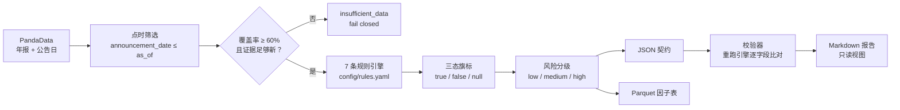

<div align="center">

# 🚩 Accounting Red Flag Detector

### 财报红旗探测器 · Lavine Version

**Agent investigates · Rules decide · Evidence explains**
智能体负责调查 · 规则负责判定 · 证据负责解释

<sub>一个<strong>时点正确（point-in-time）</strong>的 A 股财报质量筛查工具</sub>

<br/>

[](https://github.com/lavine888/Accounting-Red-Flag-Detector/actions/workflows/validate.yml)
[](https://www.python.org/)
[](LICENSE)
[](#-测试)
[](CHANGELOG.md)
[](#-七面红旗)
[](#-输出契约)

[快速开始](#-快速开始) ·
[七面红旗](#-七面红旗) ·
[输出契约](#-输出契约) ·
[数据边界](#-数据来源与边界) ·
[English](README.en.md)

</div>

---

> ### 🧭 一句话
> 把 **7 条会计红旗规则**应用到每家公司**自己、且在决策日之前已经公告**的历史年报上，
> 产出**可审计**的 JSON / Parquet 结果与前瞻收益回测。
> **缺失数据永不猜成 0，证据不足永不降级成「低风险」。**

## 📖 目录

| | |
| --- | --- |
| [🎯 为什么需要它](#-为什么需要它) | [🚩 七面红旗](#-七面红旗) |
| [🚀 快速开始](#-快速开始) | [📦 输出契约](#-输出契约) |
| [🔌 数据来源与边界](#-数据来源与边界) | [🗂 项目结构](#-项目结构) |
| [✅ 测试](#-测试) | [🚫 明确不做的事](#-明确不做的事) |
| [🗺 路线图](#-路线图) | [📄 许可证](#-许可证) |

---

## 🎯 为什么需要它

传统财务筛查常见的三个错误，以及本项目的处理方式：

| ❌ 常见错误 | 💥 后果 | ✅ 本项目的处理 |
| --- | --- | --- |
| 用最新财报回看历史 | 未来函数，回测虚高 | 按公告日做时点筛选，同一天冲突版本直接 fail closed |
| 缺失值填 `0` | 把「没有数据」当成「没有问题」 | 缺失 = `null`，并降低覆盖率，触发 `insufficient_data` |
| 用多年前的旧报表给当前打分 | 已停止披露的公司被误判为低风险 | 证据年龄 > `max_evidence_age_years` 直接 fail closed |
| 所有行业一套阈值 | 银行没有「营业成本」「存货」 | 金融业显式 `not_applicable` |

### 🧱 设计信条

| 信条 | 含义 |
| --- | --- |
| 🕰 **时点正确** | 只使用决策日之前已公告的财报（`announcement_date <= as_of`），杜绝未来函数 |
| 🚦 **三态旗标** | `true` / `false` / `null`；缺失证据永远是 `null`，绝不填 `0` |
| 🔒 **覆盖率 fail-closed** | 证据覆盖率 < 60% 一律判为 `insufficient_data`，而不是「低风险」 |
| 📅 **新鲜度 fail-closed** | 最新可见年报落后 `as_of` 超过 `max_evidence_age_years`（默认 2）同样判为 `insufficient_data` |
| 🏦 **金融业排除** | 银行 / 保险 / 证券等返回 `not_applicable`，不硬套工业规则 |
| 🎛 **阈值集中** | 全部阈值集中在 `config/rules.yaml`，代码中不存在魔法数字 |

### 🔄 工作流



---

## 🚩 七面红旗

所有阈值都在 [`config/rules.yaml`](config/rules.yaml)。
`latest` = 最近一期可见年报（q4），`prior` = 上一年年报。

| 编号 | 名称 | 判定 | 默认阈值 |
| :---: | --- | --- | :---: |
| **RF01** | 利润与现金流背离 | `CFO / 净利润 < cash_conversion_min` | `0.80` |
| **RF02** | 应收账款增速超收入 | `AR增速 > 0.20` **且** `AR增速 − 收入增速 > 0.20` | `0.20 / 0.20` |
| **RF03** | 存货增速超收入 | `存货增速 > 0.20` **且** `存货增速 − 收入增速 > 0.20` | `0.20 / 0.20` |
| **RF04** | 应计利润过高 | `(净利润 − CFO) / 平均总资产 > accrual_ratio_max` | `0.10` |
| **RF05** | 毛利率异常 | `\|最新毛利率 − 历史均值\| > max(0.05, 2σ)` | `0.05 / 2.0` |
| **RF06** | 利润与收入增速背离 | `利润增速 > 0.30` **且** `利润增速 − 收入增速 > 0.30` | `0.30 / 0.30` |
| **RF07** | 现金转化多年恶化 | 最近 3 年 `CFO/净利润` **严格递减** 且末年 `< 0.80` | `3 年 / 0.80` |

> 规则细节、字段口径和边界条件见 [`references/methodology.md`](references/methodology.md)。

### 🎚 风险分级

| 红旗数 | 风险等级 | 生产信号 | 说明 |
| :---: | :---: | :---: | --- |
| 0–1 | `low` | `clear` | 通过 |
| 2–3 | `medium` | `watch` | 关注 |
| ≥ 4 | `high` | `review` | 重点核查 |
| 覆盖率 < 60% | `insufficient_data` | `unknown` | fail closed |
| 最新年报过旧（年龄 > 2 年） | `insufficient_data` | `unknown` | fail closed |
| 金融行业 | `not_applicable` | `not_applicable` | 显式排除 |

> ⚠️ 风险等级是**证据强度**的分级，不是买卖建议，也不是收益预测。

### 🧬 行业相对证据（peer context，不改变判定）

RF02 / RF03 / RF04 / RF06 都是与公司自身上年比较，地产、建筑、To-G 等行业的应收账款、
存货、应计天然偏高，可能被误伤。每条记录附带 `peer_context`，给出该公司在**申万一级同行业**
中的分位，供调查者判断；样本不足 `peer_min_sample`（默认 5）时该指标直接缺省，绝不猜测。

> **这是上下文，不是免罪符**：`peer_context` 永远不改变任何旗标或风险等级。规则仍然独立判定——
> 因为系统性造假往往整条产业链同时异常，用同行「洗白」恰恰会掩盖工具本该暴露的案例。
> `peer_context` 由校验器从重算证据独立复算，篡改即 **FAIL**。

---

## 🚀 快速开始

> **环境要求：Python 3.11**

```bash
pip install -r requirements.txt        # 运行
pip install -r requirements-dev.txt    # 含 pytest

# 凭证只从环境变量读取，绝不写入文件或日志
export PANDA_DATA_USERNAME=...
export PANDA_DATA_PASSWORD=...
export PANDA_DATA_BASE_URL=http://pandadata.pandaaiquant.com   # 可选
```

| 场景 | 命令 |
| --- | --- |
| **单只股票** | `python scripts/build.py --as-of 20251231 --symbols 600519.SH` |
| **全市场（沪深 A 股）** | `python scripts/build.py --as-of 20251231 --all-sh-sz ...` |
| **离线演示**<br/><sub>合成数据，不是真实结果</sub> | `python scripts/build.py --as-of 20251231 --all-a --provider fixture` |
| **校验产物** | `python scripts/validate.py output/red-flags.json` |
| **生成可读报告**<br/><sub>先校验后渲染</sub> | `python scripts/report.py output/red-flags.json --min-risk medium --output output/report.md` |
| **研究回测** | `python scripts/backtest.py --signal-dates 20221230 20231229 20241231 --all-sh-sz --output output/backtest.json` |

<details open>
<summary><strong>完整命令（含全市场参数）</strong></summary>

```bash
# 单只股票
python scripts/build.py --as-of 20251231 --symbols 600519.SH

# 全市场（沪深 A 股）
python scripts/build.py --as-of 20251231 --all-sh-sz \
    --cache-dir output/panda-cache \
    --request-interval 1.2 --workers 8 \
    --json-output output/red-flags.json \
    --parquet-output production/database.parquet

# 离线演示（合成数据，不是真实结果）
python scripts/build.py --as-of 20251231 --all-a --provider fixture

# 校验产物
python scripts/validate.py output/red-flags.json
python scripts/validate.py production/database.parquet

# 生成可读报告（先校验后渲染）
python scripts/report.py output/red-flags.json \
    --min-risk medium --output output/report.md

# 研究回测
python scripts/backtest.py \
    --signal-dates 20221230 20231229 20241231 \
    --all-sh-sz --output output/backtest.json
```

</details>

<details>
<summary><strong>📌 各命令的保证与边界（点开）</strong></summary>

- **校验器**会**重新推导**每一个聚合值和风险等级；任何手改、截断或版本不符都会失败。
- **`report.py`** 先校验后渲染，未通过校验的产物直接拒绝（fail closed）。输出 Markdown：概览、
  待核查清单（每条命中规则给出 value/阈值、关键证据、行业相对分位）、证据不足清单与可追溯性。
  缺失值一律渲染为 `—`，绝不渲染成 `0`。`--min-risk high` 只看高风险，`--limit N` 限制条数。
- **`--provider fixture`** 使用**合成演示数据**，结果里 `requires_live_validation=true`，
  并且**禁止**写入 `production/database.parquet`。
- **回测**按红旗数（0/1/2/3/4+）与风险等级分组，统计 3 / 6 / 12 个月前瞻收益、命中率、
  高减低价差、组合最大回撤；**不静默丢弃样本**，无法取到收益的股票列在 `missing_symbols`。

</details>

---

## 📦 输出契约

### 🧾 JSON

顶层元数据 + 逐股票记录。关键字段：

<details>
<summary><strong>展开完整 JSON 示例</strong></summary>

```jsonc
{
  "skill_id": "ARFD-LAVINE",
  "as_of": "20251231",
  "dataset_version": "20251231-1.3.0-<hash16>",
  "rules_version": "1.2.0",
  "schema_version": "1.3.0",
  "rule_config_hash": "<sha256>",
  "source_snapshot": "<sha256>",
  "universe_hash": "<sha256>",
  "counts": { "low": 0, "medium": 0, "high": 0, "insufficient_data": 0, "not_applicable": 0 },
  "diagnostics": { "flag_trigger_counts": {}, "insufficient_reason_counts": {} },
  "records": [
    {
      "symbol": "600519.SH",
      "status": "evaluated",
      "risk_level": "low",
      "red_flag_count": 0,
      "available_rule_count": 7,
      "coverage_ratio": 1.0,
      "flags": { "cash_conversion": false, "...": null },
      "flag_details": { "cash_conversion": { "state": false, "value": 1.31, "threshold": 0.8 } },
      "evidence": { "net_profit": 0, "operating_cash_flow": 0, "cash_conversion_ratio": 1.31 },
      "announcement_dates": ["20250430"],
      "missing_reasons": [],
      "peer_context": {
        "industry_code": "801080",
        "metrics": {
          "receivable_gap": { "peer_count": 42, "peer_median": 0.08, "peer_percentile": 0.93 }
        }
      },
      "rule_version": "1.2.0"
    }
  ]
}
```

</details>

### 🗃 Parquet（生产因子表）

主键 `(trade_date, factor_id, symbol)`，重复运行是 **upsert** 而不是追加重复行。

| 列 | 说明 |
| --- | --- |
| `trade_date` / `symbol` / `factor_id` | 主键 |
| `factor_value` | 红旗数量（仅 `evaluated` 行有值） |
| `score` | 红旗数 / 有效规则数 |
| `rank` | 组内排名（仅 `evaluated`） |
| `signal` | `review` / `watch` / `clear` / `unknown` / `not_applicable` |
| `confidence` | 覆盖率 |
| `risk_level` / `status` | 风险与状态 |
| `evidence_json` | 完整逐股证据 |
| `run_metadata_json` | 运行级元数据 |
| `rules_version` / `rule_config_hash` / `schema_version` | 版本 |
| `run_id` / `source_snapshot` / `data_sdk_version` | 可追溯性 |

---

## 🔌 数据来源与边界

- 唯一数据源：**PandaData**（`panda_data` SDK），凭证仅来自环境变量。
- 使用字段：`is_revenue`、`is_oper_cost`、`is_n_income_attr_p`、`cfs_net_cash_operating`、
  `bs_net_accts_receive`、`bs_inventory`、`bs_total_assets`，以及 `date`（公告日）、`quarter`、`if_adjusted`。
- **V1 只用年报（q4）**。q4 在 PandaData 中是全年累计口径。
- 复权标记缺失（`if_adjusted` 为 `null`）会被记录为缺失原因，不做假设。

> 详细字段口径、fallback 顺序和已知限制见 [`references/data_guide.md`](references/data_guide.md)
> 与 [`references/source_boundary.md`](references/source_boundary.md)。

---

## 🗂 项目结构

<details open>
<summary><strong>展开目录树</strong></summary>

```text
accounting_red_flags/
  config.py              RuleConfig（冻结 dataclass）+ 版本 + 哈希
  models.py              三态枚举、7 个旗标名、FlagResult
  metrics.py             纯财务指标（缺失即 None，绝不产生 nan/inf）
  rules.py               7 条规则 + 风险分级
  cross_section.py       行业相对证据（附加，不改变判定）
  service.py             编排：数据 → 时点筛选 → 规则 → 运行元数据
  util.py                代码/日期/季度规范化
  point_in_time/
    reports.py           select_visible_revisions / annual_rows
    universe.py          filter_a_share_universe / select_industries
  providers/
    base.py              DataProvider 协议（唯一网络边界）
    pandadata.py         PandaData 客户端：鉴权/缓存/限速/重试/溯源
    fixture.py           合成演示数据（不可用于生产）
  materialization/
    json_writer.py       规范 JSON
    parquet_writer.py    生产 Parquet upsert
  reporting.py           JSON → Markdown 可读报告（只读视图）
  research/
    forward_returns.py   3/6/12 个月持有期
    diagnostics.py       分组统计与组合回撤
    backtest.py          前瞻收益回测
config/rules.yaml        所有阈值
scripts/                 build.py / validate.py / report.py / backtest.py
tests/                   189 个测试
references/              方法论 / 数据指南 / 来源边界
production/SKILL.md      生产部署契约
```

</details>

---

## ✅ 测试

```bash
python -m pytest -q
```

**覆盖范围**：阈值边界（严格大于 / 小于）、缺失值处理、时点筛选、同日版本冲突、
金融业排除、覆盖率 fail-closed、风险分级边界、行业相对证据、Parquet upsert、
校验器对抗性测试、Markdown 报告渲染。

> **校验器不只比对计数**：它用记录自带的 `annual_history` 和 `thresholds` **重新运行规则引擎**，
> 逐字段重建 `flags`、`flag_details`、`evidence`、覆盖率与风险等级。因此即使同步篡改记录与
> 顶层聚合，只要不能完整复现引擎输出，校验仍然失败。对抗性测试覆盖篡改计数 / 风险等级 /
> 旗标 / 证据 / 年报历史 / 诊断 / `dataset_version` / 数据来源一致性 / `peer_context`。

---

## 🚫 明确不做的事

- ❌ 不做投资建议，不做收益承诺。
- ❌ 不用模拟 / 合成数据冒充真实策略表现。
- ❌ 不用未来财报，不做前视偏差优化。
- ❌ 不把 `null` 当成 `false`，不把 `insufficient_data` 当成 `low`。
- ❌ V1 不含季报、不含附注文本、不含审计意见、不含关联交易。

---

## 🗺 路线图

未来计划与已完成里程碑见 [`ROADMAP.md`](ROADMAP.md)，版本变更见 [`CHANGELOG.md`](CHANGELOG.md)。

## 📄 许可证

[GPL-3.0](LICENSE) © lavine888

---

<div align="center">

**Agent investigates · Rules decide · Evidence explains**

🌏 [English version →](README.en.md) · 📘 [Skill spec →](SKILL.md)

</div>
